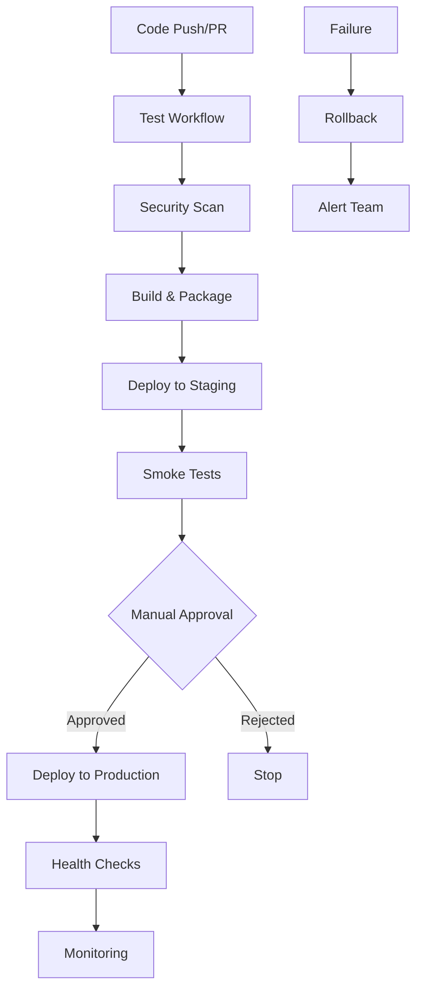

# 🚀 CI/CD Pipeline Guide

This document outlines the comprehensive CI/CD pipeline for the Humanline Backend, following industry best practices for testing, security, and deployment.

## 📋 Table of Contents

- [Overview](#overview)
- [Pipeline Architecture](#pipeline-architecture)
- [Workflows](#workflows)
- [Testing Strategy](#testing-strategy)
- [Security Scanning](#security-scanning)
- [Deployment Process](#deployment-process)
- [Monitoring & Alerts](#monitoring--alerts)
- [Troubleshooting](#troubleshooting)

## 🎯 Overview

Our CI/CD pipeline implements a comprehensive approach to software delivery with:

- **Automated Testing**: Unit, integration, and performance tests
- **Security First**: Multiple security scanning layers
- **Quality Gates**: Code quality and coverage requirements
- **Safe Deployments**: Blue-green deployments with rollback capabilities
- **Monitoring**: Comprehensive health checks and alerting

## 🏗️ Pipeline Architecture



## 🔄 Workflows

### 1. Test Workflow (`test.yml`)

**Triggers:**
- Push to `main` or `develop` branches
- Pull requests to `main` or `develop`
- Manual dispatch

**Jobs:**
1. **Code Quality & Security** - Linting, formatting, security checks
2. **Matrix Testing** - Tests across Python versions and OS
3. **Performance Testing** - Load testing with Locust
4. **Dependency Scanning** - Vulnerability assessment
5. **Test Summary** - Consolidated reporting

**Matrix Strategy:**
```yaml
strategy:
  matrix:
    os: [ubuntu-latest, windows-latest, macos-latest]
    python-version: ['3.11', '3.12', '3.13']
```

### 2. Security Workflow (`security.yml`)

**Triggers:**
- Push to `main` or `develop`
- Pull requests to `main`
- Daily schedule (2 AM UTC)
- Manual dispatch

**Security Layers:**
1. **CodeQL Analysis** - Static code analysis for vulnerabilities
2. **Dependency Security** - Safety and pip-audit scans
3. **SAST Scanning** - Bandit and Semgrep analysis
4. **License Compliance** - License compatibility checking

### 3. Deployment Workflow (`deploy.yml`)

**Triggers:**
- Push to `main` branch
- Release publication
- Manual dispatch with environment selection

**Deployment Stages:**
1. **Pre-deployment Validation** - Critical tests and security checks
2. **Build & Package** - Application packaging and artifact creation
3. **Staging Deployment** - Deploy to staging environment
4. **Production Deployment** - Blue-green production deployment
5. **Rollback** - Automatic rollback on failure

## 🧪 Testing Strategy

### Testing Pyramid

```
    /\
   /  \     E2E Tests (Few)
  /____\    
 /      \   Integration Tests (Some)
/__________\ Unit Tests (Many)
```

### Test Categories

#### Unit Tests (Fast & Isolated)
- **Schema Validation**: Pydantic model validation
- **Business Logic**: Service layer methods
- **Model Behavior**: SQLAlchemy model properties
- **Coverage Target**: 90%+

#### Integration Tests (Database Required)
- **API Endpoints**: Full request/response cycles
- **Database Operations**: Real database transactions
- **Authentication Flow**: End-to-end auth testing
- **Error Scenarios**: Comprehensive error handling

#### Performance Tests
- **Load Testing**: Concurrent user simulation
- **Stress Testing**: System limits identification
- **Endurance Testing**: Long-running stability
- **Baseline Metrics**: Performance regression detection

### Test Configuration

```ini
# pytest.ini
[tool:pytest]
testpaths = tests
asyncio_mode = auto
addopts = 
    --cov=.
    --cov-report=html
    --cov-fail-under=90
    --verbose
```

## 🔒 Security Scanning

### Multi-Layer Security Approach

#### 1. Static Analysis (SAST)
- **CodeQL**: GitHub's semantic code analysis
- **Bandit**: Python-specific security linter
- **Semgrep**: Pattern-based vulnerability detection

#### 2. Dependency Security
- **Safety**: Known vulnerability database checking
- **Pip-audit**: PyPI advisory database scanning
- **License Compliance**: License compatibility verification

#### 3. Runtime Security
- **Container Scanning**: Image vulnerability assessment
- **Secrets Detection**: Credential leak prevention
- **Infrastructure Scanning**: Cloud security posture

### Security Gates

```yaml
# Security requirements for deployment
security_requirements:
  - no_critical_vulnerabilities: true
  - dependency_scan_passed: true
  - license_compliance: true
  - sast_scan_passed: true
```

## 🚀 Deployment Process

### Environment Strategy

#### Staging Environment
- **Purpose**: Pre-production validation
- **Database**: Staging database with production-like data
- **Testing**: Automated smoke tests and manual validation
- **Access**: Development team and QA

#### Production Environment
- **Strategy**: Blue-green deployment
- **Rollback**: Automatic on health check failure
- **Monitoring**: Enhanced monitoring during deployment
- **Approval**: Manual approval gate

### Deployment Steps

1. **Pre-deployment Validation**
   ```bash
   # Critical tests
   pytest tests/unit/test_onboarding_schemas.py -x
   
   # Security check
   bandit -r . -ll
   ```

2. **Build & Package**
   ```bash
   # Create production package
   uv export --no-dev > requirements-prod.txt
   tar -czf app.tar.gz --exclude=tests .
   ```

3. **Database Migration**
   ```bash
   # Apply migrations (if any)
   alembic upgrade head
   ```

4. **Health Checks**
   ```bash
   # API health
   curl -f http://api/health
   
   # Database connectivity
   curl -f http://api/health/db
   ```

### Rollback Procedure

```yaml
rollback_triggers:
  - health_check_failure: true
  - error_rate_threshold: 5%
  - response_time_threshold: 2s
  - manual_trigger: true
```

## 📊 Monitoring & Alerts

### Health Checks

#### Application Health
- **Endpoint**: `/health`
- **Checks**: API responsiveness, database connectivity
- **Frequency**: Every 30 seconds
- **Timeout**: 5 seconds

#### Performance Metrics
- **Response Time**: P95 < 500ms
- **Error Rate**: < 1%
- **Throughput**: > 100 RPS
- **CPU Usage**: < 70%
- **Memory Usage**: < 80%

### Alert Configuration

```yaml
alerts:
  critical:
    - service_down: immediate
    - error_rate_high: 5 minutes
    - response_time_high: 5 minutes
  
  warning:
    - cpu_usage_high: 15 minutes
    - memory_usage_high: 15 minutes
    - disk_space_low: 30 minutes
```

## 🔧 Troubleshooting

### Common Issues

#### Test Failures
```bash
# Run specific failing test
pytest tests/unit/test_onboarding_service.py::test_name -v

# Debug with pdb
pytest --pdb tests/unit/test_name.py

# Check coverage
pytest --cov-report=html
```

#### Deployment Failures
```bash
# Check deployment logs
kubectl logs -f deployment/humanline-backend

# Verify health checks
curl -v http://api/health

# Check database connectivity
kubectl exec -it pod/backend -- alembic current
```

#### Security Scan Failures
```bash
# Run security scan locally
bandit -r . -f json -o report.json

# Check specific vulnerability
safety check --json | jq '.vulnerabilities'

# Update dependencies
uv sync --upgrade
```

### Debug Commands

```bash
# Local development
uv run pytest tests/ -v --tb=short

# Coverage report
uv run pytest --cov=. --cov-report=html

# Security scan
uv run bandit -r . -ll

# Performance test
uv run locust --host=http://localhost:8000 --users 10 --spawn-rate 2
```

## 📚 Best Practices

### Code Quality
- ✅ Maintain 90%+ test coverage
- ✅ Use type hints throughout codebase
- ✅ Follow PEP 8 style guidelines
- ✅ Write comprehensive docstrings
- ✅ Use meaningful commit messages

### Security
- ✅ Never commit secrets or credentials
- ✅ Use environment variables for configuration
- ✅ Regularly update dependencies
- ✅ Follow OWASP security guidelines
- ✅ Implement proper authentication and authorization

### Deployment
- ✅ Use infrastructure as code
- ✅ Implement proper monitoring and alerting
- ✅ Have rollback procedures ready
- ✅ Test deployments in staging first
- ✅ Use blue-green deployment strategy

## 📞 Support

For CI/CD pipeline issues:
- **Documentation**: This guide and workflow comments
- **Logs**: GitHub Actions workflow logs
- **Monitoring**: Application and infrastructure dashboards
- **Team**: DevOps team via Slack #devops channel

---

*This guide is maintained by the DevOps team and updated with each pipeline enhancement.*
